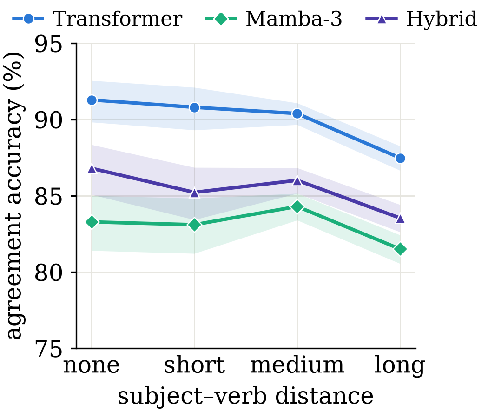

# State Tracking vs. Attention in a Morphologically Rich Low-Resource Language: A Controlled Bangla Case Study with Mamba-3

**Sahil Al Farib, Momota Ahsana Meem, Sheikh Redwanul Islam, Khan Md Shams Arefin, Azizur Rahman Anik**
Department of Computer Science & Engineering, United International University

*MRL 2026 (Workshop on Multilingual Representation Learning @ EMNLP 2026)*

📄 Paper: ACL Anthology link to be added on publication ·
🤗 Probes: [sahilfarib/bangla-agreement-probes](https://huggingface.co/datasets/sahilfarib/bangla-agreement-probes) ·
🤗 Checkpoints: [sahilfarib/mamba3-bangla-case-study](https://huggingface.co/sahilfarib/mamba3-bangla-case-study)

Do state space models' state-tracking claims transfer beyond English? We train
parameter- and token-matched Transformer, Mamba-3, and hybrid language models from
scratch on Bangla (24.5M non-embedding parameters, 1B tokens, 5 seeds each). We evaluate
them on a new suite of **4,790 native-speaker-reviewed minimal pairs** targeting Bangla
subject–verb person and honorific-register agreement.

## Results (5 seeds per architecture)

| Model | Perplexity ↓ | SVA | Attraction | Honorific | Discourse |
|---|---|---|---|---|---|
| Transformer | 42.16 ± 0.16 | **89.3 ± 1.5** | **87.0 ± 2.8** | **78.0 ± 3.5** | 64.4 ± 2.7 |
| Mamba-3 | 40.20 ± 0.06 | 83.0 ± 5.6 | 84.6 ± 6.1 | 72.5 ± 8.4 | **69.3 ± 3.7** |
| Hybrid (Mamba-3 + 2 attention layers) | **39.87 ± 0.18** | 85.0 ± 3.5 | 82.9 ± 2.6 | 70.9 ± 4.5 | 68.0 ± 2.9 |

Values are means over five seeds; ± is the cross-seed standard deviation (population SD, as in the paper). Accuracies are percentages.

1. **Recurrence yields lower perplexity.** Mamba-3 and the hybrid beat the Transformer
   in every seed (Welch *p* < 0.001).
2. **Distance.** The Transformer's agreement accuracy falls from 91.3% to 87.5% as the
   subject–verb distance grows. The drop appears in every seed and is significant
   across seeds (paired *p* = 0.01). Mamba-3 shows no significant decline (83.3% → 81.5%,
   *p* = 0.22). The hybrid declines on average, but not significantly (*p* = 0.14). A
   direct test of whether the Transformer's and Mamba-3's slopes differ is **not
   significant** (*p* = 0.15).
3. **Seed sensitivity.** Between-architecture gaps on the agreement probes do not hold
   up across seeds: SVA *p* = 0.08, attraction *p* = 0.50, honorific *p* = 0.28, and
   discourse *p* = 0.07 (the discourse gap favours Mamba-3). The main reason is that
   Mamba-3 is far more seed-sensitive (SD up to ±8.4 vs. ±3.5 for the Transformer). A
   single-seed McNemar test makes the honorific gap look significant (*p* = 0.0015),
   which shows how single-run comparisons can overclaim.
4. **Tokenization check.** In 20–37% of pairs, the correct and incorrect sentences split
   into a different number of subword tokens. Because scoring is not length-normalized,
   this affects raw accuracy, but on length-matched pairs the patterns above are
   unchanged (seed 1).



## What is released

| Artifact | In this repo | On Hugging Face |
|---|---|---|
| Probe suite (4,790 pairs, 4 TSVs) | [`data/probes/`](data/probes) | [bangla-agreement-probes](https://huggingface.co/datasets/sahilfarib/bangla-agreement-probes) |
| Probe generator + reviewed lexicon | [`bangla_ssm/probes/`](bangla_ssm/probes) | — |
| Per-seed eval results + seed-1 per-pair outputs | [`results/`](results) | `results/` in the checkpoint repo |
| Aggregated numbers behind every table and figure | [`paper/results.json`](paper/results.json) | — |
| 15 checkpoints (3 architectures × 5 seeds) + configs | [`configs/`](configs) (configs only) | [mamba3-bangla-case-study](https://huggingface.co/sahilfarib/mamba3-bangla-case-study) |
| 32k SentencePiece tokenizer | — | `tokenizer/bn_bpe32k.model` in the checkpoint repo |
| Training / eval code, Colab pipeline | [`bangla_ssm/`](bangla_ssm), [`scripts/`](scripts), [`notebooks/`](notebooks) | — |

The probe TSVs and `results/` are byte-identical to the Hugging Face copies, and a test
checks that the committed probes equal the generator's output.

**Probe format.** Each TSV row has these columns: `id, phenomenon, subj_person, wrong_person, lure_person, distance, tense, sen, wrong_sen`.
A model is correct on a pair if log P(`sen`) > log P(`wrong_sen`), using total log-probability.

| Code | Meaning |
|---|---|
| `p1` | 1st person |
| `p2_int` | 2nd person intimate (তুই) |
| `p2_fam` | 2nd person familiar (তুমি) |
| `p2_hon` | 2nd person honorific (আপনি) |
| `p3_ord` | 3rd person ordinary (সে, or a noun subject such as ছেলেটি) |
| `p3_hon` | 3rd person honorific (তিনি/উনি) |

`distance` takes these values:

- SVA: `none`, `short`, `medium`, `long`
- Attraction: `attractor`
- Honorific: `none`
- Discourse: `adjacent` or `one_filler` (whether a verbless filler sentence sits between the two sentences)

**Seed naming.** Result files use `s1` and `s2` for seeds 1337 and 2024. Seeds 3419,
5150, and 8888 appear under their own numbers. The `_53m` suffix on config names is a
historical label. The models have ~24.5M non-embedding parameters plus 16.8M in the tied
embedding.

## Reproduce the paper's numbers (CPU only, no training data needed)

```bash
pip install -r requirements.txt
pytest -q                                           # probe + data tests
python paper/stats.py --dumps results/per_pair      # CIs, cross-seed Welch tests, seed-1 McNemar
python paper/interaction_test.py                    # architecture x distance test, paired within-model tests
python paper/tokenization_check.py                  # subword-length check (downloads the tokenizer)
python paper/figures.py                             # regenerates paper/figures/
python paper/aggregate_seeds.py                     # rebuilds paper/results.json from results/
```

## Score a released checkpoint

Mamba-3 and the hybrid need a CUDA GPU and `mamba-ssm>=2.3.2`. The Transformer only
needs `torch`, `transformers`, and `sentencepiece`.

```python
from huggingface_hub import snapshot_download
snapshot_download("sahilfarib/mamba3-bangla-case-study", local_dir="hf",
                  allow_patterns=["transformer_seed1337/*", "tokenizer/*"])
```

```bash
python -m bangla_ssm.eval_minimal_pairs \
  --config hf/transformer_seed1337/config.json \
  --ckpt hf/transformer_seed1337/checkpoint.pt \
  --sp_model hf/tokenizer/bn_bpe32k.model \
  --tsv data/probes/sva.tsv data/probes/attraction.tsv data/probes/honorific.tsv data/probes/discourse.tsv \
  --out my_results.json
```

`--hf_model <repo>` scores any Hugging Face causal LM on the same probes.

## Full pipeline (Colab)

Open [`notebooks/colab_driver.ipynb`](notebooks/colab_driver.ipynb), set the `HF_TOKEN`
Colab secret, and run the cells top to bottom:

1. Install dependencies.
2. Train the tokenizer.
3. Pretokenize FineWeb-2 `ben_Beng`.
4. Check the parameter match.
5. Train 3 architectures × 5 seeds (about 3 A100-hours per run).
6. Evaluate.
7. Aggregate.
8. Publish.

Every long step resumes after a Colab disconnect. The hybrid ablation configs
(`hybrid_1attn_53m.json`, `hybrid_4attn_53m.json`) are optional and not part of the
paper.

## Repository layout

```
bangla_ssm/              models.py (param-matched Transformer / Mamba-3 / hybrid), data.py,
                         train.py, eval_ppl.py, eval_minimal_pairs.py, profile_throughput.py
bangla_ssm/probes/       lexicon.py (native-speaker-reviewed conjugations), generate.py
data/probes/             released probe TSVs
results/                 per-seed results_*.json, ppl_*.json; per_pair/ seed-1 item-level CSVs
paper/                   results.json, stats.py, interaction_test.py, tokenization_check.py,
                         aggregate_seeds.py, figures.py, figures/
configs/                 model configs (main runs: *_53m.json; toy dev configs: *_toy.json)
scripts/                 tokenizer training, pretokenization, parameter count
notebooks/               colab_driver.ipynb (end-to-end pipeline)
hf_cards/                Hugging Face dataset and model cards (uploaded by the notebook)
tests/                   CPU-only tests
docs/                    pre-experiment planning notes (historical)
```

## Citation

```bibtex
@inproceedings{farib2026statetracking,
  title     = {State Tracking vs. Attention in a Morphologically Rich Low-Resource Language:
               A Controlled {B}angla Case Study with {M}amba-3},
  author    = {Sahil Al Farib and Momota Ahsana Meem and Sheikh Redwanul Islam and
               Khan Md Shams Arefin and Azizur Rahman Anik},
  booktitle = {Proceedings of the 6th Workshop on Multilingual Representation Learning (MRL 2026)},
  year      = {2026},
  note      = {To appear}
}
```

## License

Code, probes, results, and checkpoints are released under the MIT License (see
[LICENSE](LICENSE)). The models are trained on
[FineWeb-2](https://huggingface.co/datasets/HuggingFaceFW/fineweb-2) (ODC-By 1.0). The
Mamba-3 block comes from the Apache-2.0
[`mamba-ssm`](https://github.com/state-spaces/mamba) package.
