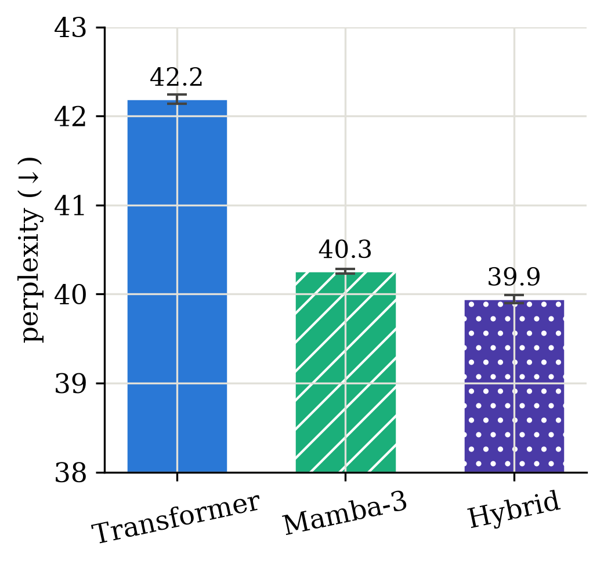
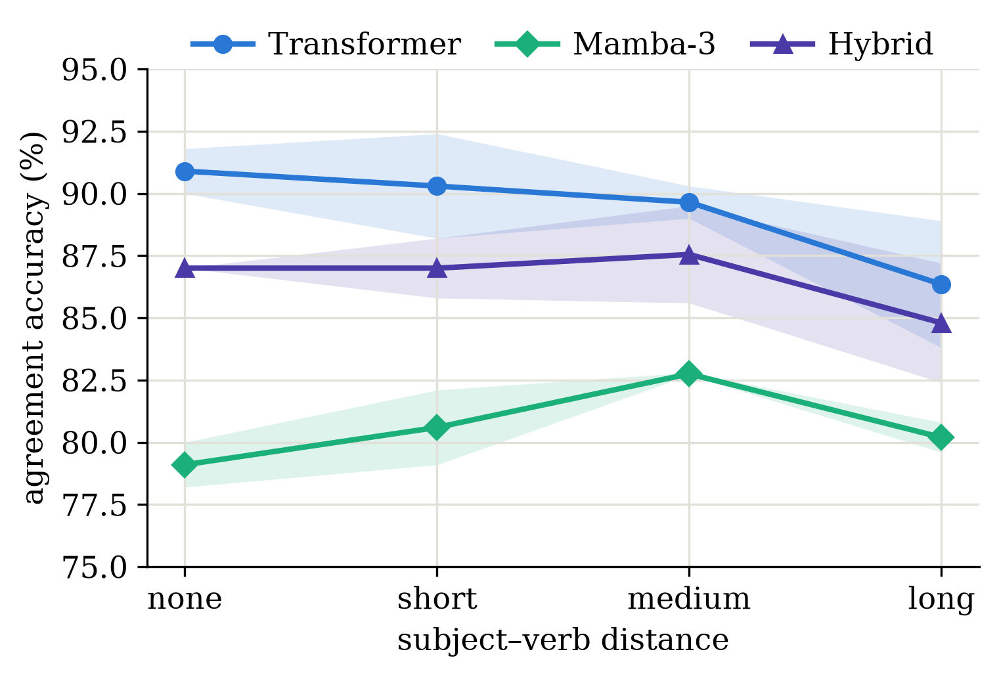
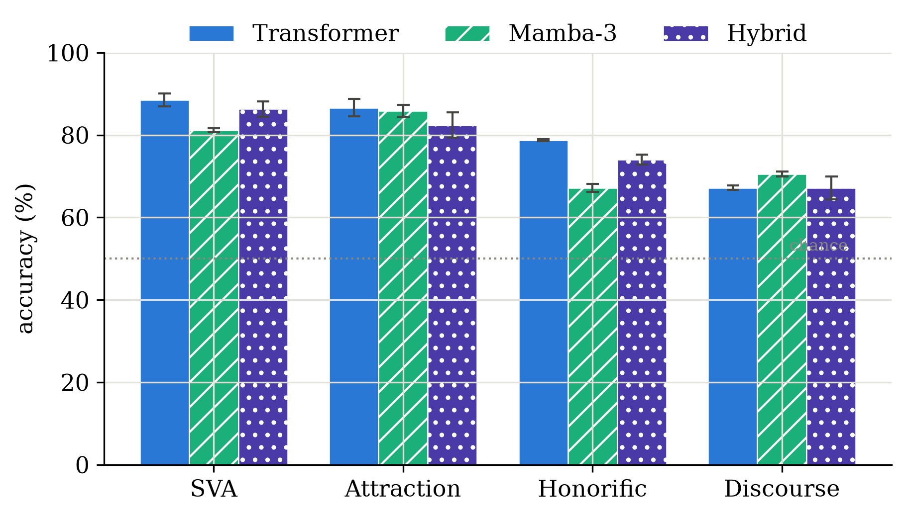

# State Tracking vs. Attention in a Morphologically Rich Low-Resource Language: A Controlled Bangla Case Study with Mamba-3

**Sahil Al Farib**
*[Affiliation]* · sahilfarib320@gmail.com

Code: <https://github.com/sahilaf/Mamba3_Bangla_Case_Study> ·
Probes: <https://huggingface.co/datasets/sahilfarib/bangla-agreement-probes> ·
Checkpoints: <https://huggingface.co/sahilfarib/mamba3-bangla-case-study>

---

## Abstract

State-space models such as Mamba-3 claim improved state-tracking over attention while
running in sub-quadratic time, but these claims are validated almost entirely on
English. We ask whether they transfer to a morphologically rich, low-resource setting
by training parameter- and token-matched Transformer, Mamba-3, and hybrid language
models (24.5M non-embedding parameters, 1B tokens) from scratch on Bangla, and
evaluating them on a new suite of 4,790 native-speaker-reviewed minimal pairs targeting
Bangla subject–verb person/honorific agreement. We find a clean dissociation that holds
across two seeds: **the Transformer's agreement accuracy degrades as the subject–verb
distance grows, while Mamba-3's does not** — yet the Transformer retains higher absolute
accuracy on local agreement, and Mamba-3 attains lower perplexity. A hybrid (Mamba-3
backbone with two attention layers) obtains the best perplexity and recovers much of the
local-agreement gap, but does not uniformly dominate. Perplexity does not predict
morphosyntactic competence in this setting, and fixed-size recurrent state trades local
precision for robustness to distance. We release the code, the probe suite, and all six
checkpoints.

## 1. Introduction

Sub-quadratic sequence models have re-emerged as credible alternatives to the
Transformer. Mamba-3 (Lahoti et al., ICLR 2026) argues that a more expressive
recurrence, complex/rotary state updates, and multi-input–multi-output projections
improve *state tracking* — the ability to maintain and update structured information
across a sequence. Its evaluations, like those of most architecture papers, are
English-centric.

Bangla (Bengali, ~285M speakers) offers a sharp test. Its finite verbs agree with the
subject in **person and honorific register** — not number — and this agreement can hold
across long spans and even across a dropped (pro-drop) subject in a following sentence.
Whether a fixed-size compressed state helps track such dependencies, or whether it hurts
when training data is already scarce, is untested for Bangla or, to our knowledge, any
South Asian language.

We run a deliberately small, controlled comparison — the same methodology the Mamba-2
and Mamba-3 papers use to validate their own claims — asking:

> Does Mamba-3's state-tracking advantage translate into better Bangla subject–verb
> agreement than a parameter- and token-matched Transformer, and does interleaving a few
> attention layers into a Mamba-3 backbone combine their strengths?

Our contributions:
1. A **controlled three-way comparison** (Transformer, Mamba-3, hybrid) at iso-parameter,
   iso-token scale on Bangla, with two seeds each.
2. A **reusable probe suite** of 4,790 native-speaker-reviewed Bangla minimal pairs for
   person/honorific agreement, distance-binned, including agreement attraction and
   cross-sentence pro-drop conditions with no English analogue.
3. A replicated **dissociation**: attention degrades with distance, Mamba-3 does not;
   attention wins local agreement, Mamba-3 wins perplexity and the hardest cross-sentence
   probe.

## 2. Related work

**Targeted syntactic evaluation.** Minimal-pair benchmarks (Linzen et al., 2016; BLiMP,
Warstadt et al., 2020) score whether a model assigns higher probability to a grammatical
sentence than to a minimally different ungrammatical one. MultiBLiMP 1.0 (Jumelet et al.,
TACL 2026) extends this to 101 languages via Universal Dependencies, but its automatic
pipeline yields only 21 Bengali pairs — too few to analyse by condition, and none
covering honorific register or cross-sentence agreement. Our hand-built suite fills that
gap.

**State-space and hybrid models.** Mamba (Gu & Dao, 2023), Mamba-2, and Mamba-3 (Lahoti
et al., 2026) develop selective SSMs with strong English language-modeling results.
Hybrids that interleave a small number of attention layers into an SSM backbone (Samba;
Jamba; Zamba) are now standard for recovering in-context precision cheaply; we adopt this
recipe for our third model.

**Low-resource Bangla LMs.** Prior Bangla work (BanglaBERT; TituLM; BanglaMixLoRA)
adapts existing architectures or applies existing adaptation techniques. We instead test
a falsifiable *architectural* hypothesis under matched compute — a question that is new
regardless of which model wins.

## 3. Method

### 3.1 Models

All three models are decoder-only causal LMs matched on **non-embedding** parameters
(~24.5M; embeddings are identical across models and excluded from the matching criterion)
and share a 32k SentencePiece BPE vocabulary with tied input/output embeddings.

- **Transformer** — Llama-style: RoPE, SwiGLU MLP, RMSNorm, full multi-head attention.
- **Mamba-3** — the official `Mamba3` block (state-spaces/mamba) stacked in a pre-norm
  RMSNorm residual tower, SISO (single-input–single-output) variant.
- **Hybrid** — the Mamba-3 tower with self-attention (RoPE) substituted at 2 of 15 layers
  (a Samba/Jamba-style sparse interleave).

Parameter counts are matched to within 0.1% by tuning the Transformer's MLP width and the
hybrid's depth. Blocks share the same pre-norm residual structure across all three models,
so the only controlled variable is the per-layer token mixer.

### 3.2 Data and training

We train from scratch on the Bangla (`ben_Beng`) split of FineWeb-2 (Penedo et al.,
2024) — a cleaned, deduplicated, permissively-licensed web corpus. We tokenize 1.0B
training tokens (≈41 tokens/parameter, ~2× Chinchilla-optimal) with a held-out test split
for perplexity. All models use identical optimization: AdamW, cosine schedule, matched
batch size and token budget, bf16, sequence length 1024. Each architecture is trained
with two seeds (1337, 2024). Total compute is ≈3 A100-hours per run.

### 3.3 Probe suite

We construct 4,790 minimal pairs from hand-written Bangla conjugation tables (10 verbs ×
3 tenses × 6 person/register cells) and reusable sentence frames. **A native speaker
reviewed the underlying lexicon** — verb morphology, temporal-adverb compatibility,
intervener naturalness, and discourse coherence — and every issue was corrected before
scoring. Four conditions:

| Condition | Pairs | What it tests |
|---|---|---|
| **SVA** | 3,300 | subject–verb person/register agreement, interveners binned by length (none/short/medium/long) |
| **Attraction** | 1,190 | a competing-person pronoun inside the intervener lures the wrong agreement |
| **Honorific** | 210 | তিনি/উনি vs. সে register agreement (single sentence) |
| **Discourse** | 90 | register set in sentence 1, agreement tested on a pro-drop sentence 2 (± a verbless filler) |

Each pair is `(sen, wrong_sen)`; a model is **correct** if it assigns higher total
log-probability to the grammatical `sen` (the BLiMP protocol). We report accuracy overall
and by condition; the SVA distance bins are the key analysis.

## 4. Results

All numbers are the mean of two seeds; bands/error bars show the seed range.

### 4.1 Perplexity

Mamba-3 (40.3) and the hybrid (39.9) both beat the Transformer (42.2) on held-out
perplexity, tightly across seeds. **General language-modeling quality favors the SSM
family** — the opposite of the agreement results below.

### 4.2 The headline: agreement vs. distance

The Transformer starts highest but **degrades monotonically as the subject–verb distance
grows** (90.9% → 86.4%). Mamba-3 starts lower but is **flat-to-rising** (79.1% → 80.2%,
peaking at medium distance). This direction holds in *both* seeds (Transformer −2.9pp and
−6.2pp none→long; Mamba-3 +1.4pp and +0.8pp). Attention's advantage is a *local* one that
erodes with distance; the SSM's fixed recurrent state shows no such decay. The hybrid sits
between the two and is less stable across distance than pure Mamba-3.

### 4.3 Agreement by condition

| Model | SVA | Attraction | Honorific | Discourse |
|---|---|---|---|---|
| Transformer | **88.5** | **86.6** | **78.8** | 67.2 |
| Mamba-3 | 81.2 | 85.9 | 67.1 | **70.6** |
| Hybrid | 86.3 | 82.4 | 74.1 | 67.2 |

The **Transformer leads local agreement** (SVA, attraction, honorific). Mamba-3's honorific
weakness is notable (67.1%). But on **discourse** — register agreement across a sentence
boundary with a dropped subject, the longest-range and hardest probe — **Mamba-3 is best
and most stable** (70.6%), consistent with its recurrent state carrying register across
the boundary. The hybrid recovers most of the SVA and honorific gap relative to Mamba-3
but does not surpass the Transformer on any local condition, and shows the highest
cross-seed variance on discourse and honorific.

### 4.4 The p2-intimate artifact

The 2nd-person intimate register (তুই; forms like করিস) is very rare in web text. On this
cell Mamba-3 scores *below chance* (12.0% / 25.3%) and the hybrid is unstable
(49.3% / 74.7%), while the Transformer is stable (79.7% / 82.7%). This is a
frequency/tokenization effect, not state-tracking; we exclude it from the main SVA figures
and report it separately. Excluding p2-intimate, the SVA gap between Transformer and
Mamba-3 narrows from ~7pp to ~4pp.

## 5. Discussion

Two findings cut against a naive reading of "Mamba-3 tracks state better, so it should win
agreement":

1. **Perplexity dissociates from morphosyntactic competence.** Mamba-3 models Bangla text
   better (lower perplexity) yet is worse at explicit local agreement. Perplexity alone
   would have hidden this.
2. **Fixed-size state trades local precision for distance robustness.** Attention pays for
   its direct access to the subject with a decay over distance; the SSM's compressed state
   is less precise locally but does not decay, and is best at the cross-sentence case.

The hybrid confirms these are somewhat separable competencies — two attention layers buy
back local precision and the best perplexity — but "just add attention" does not yield a
strict improvement over both parents, and it can increase variance. Where to place, and
how many, attention layers for morphologically rich languages is an open question.

## 6. Limitations

- **Scale.** One model size (24.5M non-embedding), one token budget (1B). Trends may not
  hold at scale; this is a pilot, not a scaling study.
- **Seeds.** Two seeds per model. Large gaps (distance trend, honorific) are robust;
  small ones (discourse ranking, hybrid on honorific) have 3–6pp cross-seed spread and are
  reported as suggestive.
- **Probe construction.** Templated from a finite lexicon; native-speaker-reviewed but not
  drawn from natural corpora. The honorific and discourse sets are small (210, 90).
- **SISO only.** We do not evaluate Mamba-3's MIMO variant (requires kernels unavailable in
  the released package build).

## 7. Conclusion

In a controlled, iso-parameter, iso-token Bangla comparison, Mamba-3's fixed recurrent
state does not uniformly help or hurt agreement: it makes the model *worse* at nearby,
explicit agreement but *more robust* to distance and better across a sentence boundary,
while achieving lower perplexity than a matched Transformer. A sparse hybrid recovers much
of the local gap and the best perplexity without strictly dominating. The result is new
for Bangla and, we believe, for South Asian morphologically rich languages generally. We
release the probe suite, code, and checkpoints to support replication and extension to
other languages and scales.

## References

- Gu, A. and Dao, T. (2023). *Mamba: Linear-Time Sequence Modeling with Selective State
  Spaces.*
- Lahoti, A., Li, K. Y., et al. (2026). *Mamba-3: Improved Sequence Modeling using State
  Space Principles.* ICLR 2026.
- Jumelet, J., Weissweiler, L., et al. (2026). *MultiBLiMP 1.0: A Massively Multilingual
  Benchmark of Linguistic Minimal Pairs.* TACL.
- Warstadt, A., et al. (2020). *BLiMP: The Benchmark of Linguistic Minimal Pairs for
  English.* TACL.
- Linzen, T., Dupoux, E., and Goldberg, Y. (2016). *Assessing the Ability of LSTMs to Learn
  Syntax-Sensitive Dependencies.* TACL.
- Penedo, G., et al. (2024). *FineWeb-2: A sparse, multilingual pretraining corpus.*
- Ren, L., et al. (2025). *Samba: Simple Hybrid State Space Models for Efficient Unlimited
  Context Language Modeling.*
- Lieber, O., et al. (2024). *Jamba: A Hybrid Transformer-Mamba Language Model.*

---

*Appendix (per-seed tables, full per-condition breakdowns, and the conjugation lexicon)
is available in the repository under `paper/results.json`, the probe generator under
`bangla_ssm/probes/`, and the eval outputs under the released model repo `results/`.*
